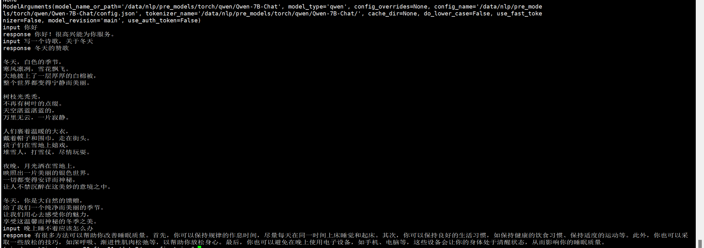

##  statement
```text
    2023-10-19 微调推理初步测试完成
    2023-10-18 初始化
```

##  update 
- [deep_training](https://github.com/ssbuild/deep_training)


## install
  - pip install -U -r requirements.txt
  - 如果无法安装 , 可以切换官方源 pip install -i https://pypi.org/simple -U -r requirements.txt  

```text

# flash-attention对显卡算例要求算力7.5 以上 ， 下面可选安装 ，如果卡不支持可以不安装。
git clone -b v1.0.8 https://github.com/Dao-AILab/flash-attention
cd flash-attention && pip install .
pip install csrc/layer_norm
pip install csrc/rotary
```


## weight

 - [Qwen-VL](https://huggingface.co/Qwen/Qwen-VL)
 - [Qwen-VL-Chat](https://huggingface.co/Qwen/Qwen-VL-Chat)


## data sample
   open_data https://github.com/ssbuild/open_data
    
单条数据示例

```text
p prefix  optional
q question optional
a answer   must

```

```json
 {
    "id": 0, 
    "p": null,
    "paragraph": [
         {
             "q": "Picture 1: https://qianwen-res.oss-cn-beijing.aliyuncs.com/Qwen-VL/assets/demo.jpeg</img>\n图中的狗是什么品种？",
             "a":  "图中是一只拉布拉多犬。"
         },
        {
           "q": "框出图中的格子衬衫",
           "a": "<ref>格子衬衫</ref><box>(588,499),(725,789)</box>"
        }
     ]
 }

```
或者

```json
{
    "id": 0,
    "conversations": [
      {
        "from": "user",
        "value": "Picture 1: https://qianwen-res.oss-cn-beijing.aliyuncs.com/Qwen-VL/assets/demo.jpeg</img>\n图中的狗是什么品种？"
      },
      {
        "from": "assistant",
        "value": "图中是一只拉布拉多犬。"
      },
      {
        "from": "user",
        "value": "框出图中的格子衬衫"
      },
      {
        "from": "assistant",
        "value": "<ref>格子衬衫</ref><box>(588,499),(725,789)</box>"
      }
    ]
  }
```


## infer
    # infer.py 推理预训练模型
    # infer_finetuning.py 推理微调模型
    # infer_lora_finetuning.py 推理lora微调模型
     python infer.py


| **量化等级**    | **最低 GPU 显存** |
| -------------- | ----------------- |
| FP16（无量化）   | 13 GB             |
| INT8           | 10 GB              |
| INT4           | 6 GB               |

   




## training
```text
    # 制作数据
    cd scripts
    bash train_full.sh -m dataset 
    or
    bash train_lora.sh -m dataset 
    or
    bash train_ptv2.sh -m dataset 
    
    注: num_process_worker 为多进程制作数据 ， 如果数据量较大 ， 适当调大至cpu数量
    dataHelper.make_dataset_with_args(data_args.train_file,mixed_data=False, shuffle=True,mode='train',num_process_worker=0)
    
    # 全参数训练 
        bash train_full.sh -m train
        
    # lora adalora ia3 
        bash train_lora.sh -m train
        
    # ptv2
        bash train_ptv2.sh -m train
```

## 训练参数
[训练参数](args.MD)


## 友情链接

- [pytorch-task-example](https://github.com/ssbuild/pytorch-task-example)
- [chatmoss_finetuning](https://github.com/ssbuild/chatmoss_finetuning)
- [chatglm_finetuning](https://github.com/ssbuild/chatglm_finetuning)
- [chatglm2_finetuning](https://github.com/ssbuild/chatglm2_finetuning)
- [t5_finetuning](https://github.com/ssbuild/t5_finetuning)
- [llm_finetuning](https://github.com/ssbuild/llm_finetuning)
- [llm_rlhf](https://github.com/ssbuild/llm_rlhf)
- [chatglm_rlhf](https://github.com/ssbuild/chatglm_rlhf)
- [t5_rlhf](https://github.com/ssbuild/t5_rlhf)
- [rwkv_finetuning](https://github.com/ssbuild/rwkv_finetuning)
- [baichuan_finetuning](https://github.com/ssbuild/baichuan_finetuning)
- [baichuan2_finetuning](https://github.com/ssbuild/baichuan2_finetuning)
- [internlm_finetuning](https://github.com/ssbuild/internlm_finetuning)
- [qwen_finetuning](https://github.com/ssbuild/qwen_finetuning)
## 
    纯粹而干净的代码


## Reference
    https://github.com/QwenLM/Qwen-VL


## Star History

[](https://star-history.com/#ssbuild/qwen_vl_finetuning&Date)

